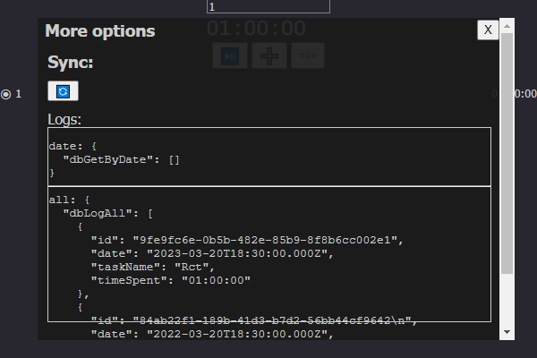
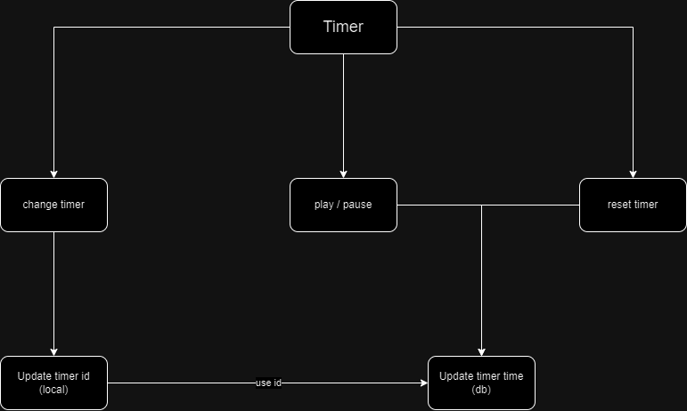

# Timer app

## Built with Electron, React & tRPC.

### TechStacks

- Electron
- React
  - Hooks - useState, useEffect, useImperative, useCallback
- React Query
- TypeScript
- Zod
- CSS in modules
- tRPC
- SQLite
- Prisma

<br /> <hr /> <br />

### Screenshots

#### home



<br /> <hr /> <br />

### Flow charts

#### 1. State changes



<br /> <hr /> <br />

### Codes

#### 1. to start - dev mode

```
  # frontend and backend
    npm i --save-exact
    npm run postinstall
    npm run start

  # db
    # to use prisma client
    npx prisma generate
    # creates db.sqlite file w/ tables
    npx prisma db push
    npm run dev:server

```

#### 2. to create application package

```
  npm run package
```

#### 3. to start - prod mode

```
  # frontend and backend
    directly use electron app

  # db
    npm run build:server
    npm run start:server
```

#### 4. misc

#### 4a. prisma schema update

```
  npx prisma migrate dev --create-only
  npx prisma migrate dev
```

#### 4b. prisma studio

```bash
  npx prisma studio
```

<br />

#### 👉 refer .TODO file for reference docs

<br />

### credits

#### electron - react template

[electron-react-boilerplate repo](https://github.com/electron-react-boilerplate/electron-react-boilerplate)

<br /> <hr /> <br />
