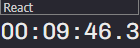

# Timer app

## Built with Electron, React & SCSS.

<br /> <hr /> <br />

### Screenshots

#### home



<br /> <hr /> <br />

### codes

#### 1. to start

```
  # frontend and backend
  npm i --save-exact
  npm run postinstall
  npm run start

  # db
  npx prisma generate
  npx prisma db push
  npm run dev:server

```

#### 2. misc

#### 2a. prisma schema update

```
  npx prisma migrate dev --create-only
  npx prisma migrate dev
```

#### refer todo for reference docs
